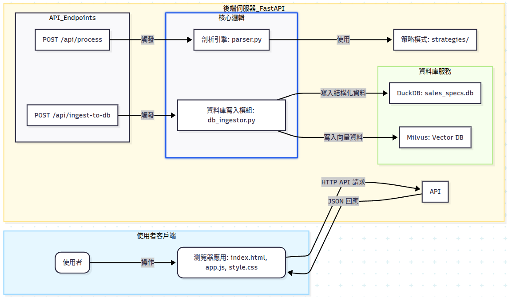

# MLINFO_Data_Processing

A data processing web application for extracting and structuring laptop/notebook specifications from text files. The system consists of a FastAPI backend with database ingestion capabilities and a vanilla JavaScript frontend.

## 🚀 Quick Start

### Prerequisites

- Python 3.7+
- Milvus server (optional, for vector storage)

### 📦 Installation & Setup

1. **Clone the repository**

   ```bash
   git clone <repository-url>
   cd MLINFO_Data_Processing
   ```

2. **Set up the backend**

   ```bash
   cd backend
   pip install -r requirements.txt
   ```

3. **Set up environment variables** (optional)

   ```bash
   # Create .env file in backend directory
   MILVUS_HOST=localhost
   MILVUS_PORT=19530
   ```

### 🏃 Running the Application

#### Step 1: Start the Backend Server

```bash
cd backend
uvicorn app.main:app --reload --host 0.0.0.0 --port 8000
```

#### Step 2: Start the Frontend Server

(in a new terminal)

```bash
cd frontend
python -m http.server 8080
```

#### Step 3: Access the Application

- **Web Interface**: <http://localhost:8080>
- **API Documentation**: <http://localhost:8000/docs>
- **API Root**: <http://localhost:8000>

### 🛠️ Alternative Frontend Setup

If you prefer using Node.js:

```bash
cd frontend
npx serve . -p 8080
```

## 📁 Project Structure

```text
mlinfo_data_processing/
├── backend/
│   ├── app/
│   │   ├── strategies/
│   │   │   ├── __init__.py
│   │   │   ├── base_strategy.py
│   │   │   └── concrete_strategies.py
│   │   ├── __init__.py
│   │   ├── db_ingestor.py
│   │   ├── default_rules.json
│   │   ├── main.py
│   │   ├── models.py
│   │   └── parser.py
│   ├── .env
│   └── requirements.txt
│
└── frontend/
    ├── app.js
    ├── index.html
    └── style.css
```

## 🎯 How to Use

1. **Start both servers** following the steps above
2. **Open the web interface** at <http://localhost:8080>
3. **Upload a text file** or paste text content
4. **Process the data** using the built-in rules
5. **Edit results** in the interactive table
6. **Export to CSV** or ingest into databases

## 📊 System Architecture



## 🔧 Development

- **Backend**: FastAPI with Python 3.7+
- **Frontend**: Vanilla JavaScript (no frameworks)
- **Database**: DuckDB (structured data) + Milvus (vector search)
- **Processing**: Rule-based text extraction with regex patterns
